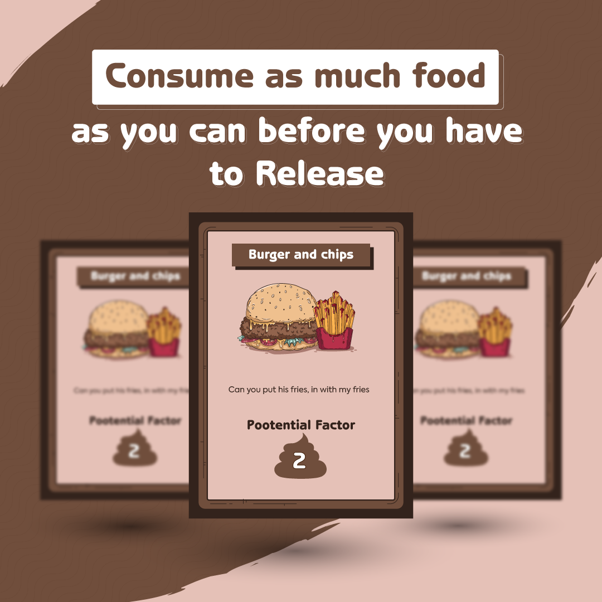

### A fun game all about who can brew up the biggest poo! But be careful you don't poo too soon!""

## Meet the Creators

<b>Tomas Pilvelis</b>: Over the past 10 years, I don't think there has not been a day where we have not spoken about poo.

<b>Edward Cook</b>: Theres nothing more life affirming than brewing a nice poo all day, taking the weight off be sitting on the toilet, and then squeezing out a hoggie.

Hi All, It's Tom and Ed. CPO's (Chief Poo Officers) of Team About LTD, about to bring you a new exciting card game...all about poo!

Up until this point we have been self funding Big-Pootential and we now think its time to put it to the public. Any funding will help us achieve our dream getting this great game out there and will go toward the final hurdles of artwork and production costs.

During our friendship we have mainly spoken about our poos, this lead to the idea of turning our love for poo into a card game! After much descussion we decided to go for it, what have we got to lose?! We have tested prototypes of Big Pootential and we think now is the time to start putting it out to the world.

We enjoy playing Big Pootential and we hope you will too!

## Rewards

_Folder/Post-2.2(kickstarter).png)
_Folder/Post-4.1(kickstarter).png)

| Pledge Minimum | Title | Description | Deck of Cards Reward |
| --- | --- | --- | --- |
| £10 | Pledge Without Reward | Support the project, show some love to see the project comes to light | 🟥 |
| £25 | Pledge & Pre Order | Pledge your support to make this project work and pre order Big Pootential Card Game to arrive before Christmas! | 🟩 |

## Timeline 

## Rules

### Game Rules

_Folder/Post-2.1(kickstarter).png)

1-4 players

Key Rule: Player who <b>pooped most recently goes first</b>.

As gameplay commences, food cards are key to brewing, creating, developing, the largest poo in the game.

Beware however of traps your opponents may enforce upon you. Cards like 'laxative' will reduce your likely hood of winning with the largest poo.

The End of the game is when you pick up a Release card, this ends your game whilst others can continue to grow their poo.

At the end, the largest poo emerges as the victor.

Detailed rules come as part of the game.

### Drinking Game Rules

#### Drink on drinks

Everytime you get a drink card, you drink

#### Higher or Lower

Place the cards upside down, fip a card upwards. Then guess the next card to be higher or lower, then flip. If a correct guess Well Done, if wrong DRINK!

## Risks and challenges

Risks:
Currently we dont forsee any major risks to the project.

Challenges:
Our only challenege we keep facing is our finances due to being self funded, we hope this Kick Starter will remove this challenge and allow us to put the game into production.

